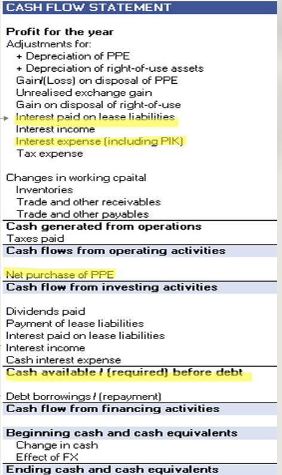

## Table of Content
- [Importance of Financial Modelling](#importance-of-Financial-Modelling)
- [Financial Statements](#Financial-Statements)
- [Excel](#Excel)
- [Building the model](#Building-the-model)

***
_Credit: Note taking from NUS Business School Financial Modelling Course by Ms Loke Huey Teng_
***

## Importance of Financial Modelling

_**Vital role of financial modelling:**_
1. business framework

Framework to project business outcomes, allowing organisations to visualise their financial future based on available data and assumptions.

2. data integration

Effectively combines past data and assumptions, enabling businesses to make informed decisions based on historical performance and realistic forecasts for future growth.

3. decision support

Provide deeper insights into potential outcomes, helping stakeholders understand implications of different strategies and mitigating risks

### Kind of Decisions

1. Investment

By projecting potential returns and risks associated with ventures.

2. Expansion

By predicting market trends and resource needs for growth.

3. Budgeting

By ensuring resources are allocated efficiently to meet objectives.

### Attributes of good financial models
- Simple but not so simple to artificially distort reality
- Focuses on the key factors and drivers of the business (i.e., key factors that drive the business forward)
- conveys the assumptions and conclusions that business and decision makers care about - e.g., if we are assuming the revenue will grow by 5%, make it clear in the model
- Evaluate the risks around the business through sensitivity analysis, scenario analysis, breakeven analysis.

## Financial Statements

### [Income statement](https://www.investopedia.com/terms/i/incomestatement.asp)
> The income statement is a financial report that summarizes a company's financial performance over a specific accounting period. It includes a company's revenue, expenses, and net income.
Reflects business performance over time, indicating profitability and revenue trends.

Key components: Measurement of performance
- revenue generation insights
- expense tracking overview
- profitability assessment metrics

### [Balance Sheet](https://www.investopedia.com/terms/b/balancesheet.asp)
> A balance sheet is a financial statement that provides a snapshot of a company's assets, liabilities, and shareholder equity at a specific point in time.
Illustrates a company's financial position, detailing assets, liabilities and equity.

Key components: snapshot of financial position
- asset valuation details
- liability obligations overview
- equity representation insights

The accounting equation:
Assets = Liabilities + Equity 
- equity = owner's capital - owner's withdrawals + revenue - expenses
- Profits/Retained earnings = revenue - expenses

### [Cash Flow](https://www.investopedia.com/investing/what-is-a-cash-flow-statement/)
> A cash flow statement shows how money flows in and out of a company through operations, investments, and financing activities. 
Shows liquidity, tracking cash inflows and outflows for financial health.

Key components: 
- cash generation
- application and source of funding
- short term liquidity and long term viability

### Items that link the statements together

#### Net income & retained earnings
> - Net income from the bottom of the income statement links the retained earnings/accumulated profits on the cash flow statement and balance sheet.

#### PP&E, Depreciation, Capex
> - Depreciation and other capitalized expenses on the income statement will be added back to net income to calculate cash flow from operations.
> 
> - Depreciation flows out of the balance sheet (PP&E) onto the income statement as an expense.

#### Working capital
> - Changes in WC on balance sheet are related to revenues and expenses on the income statement (recognised revenues and expenses)
> 
> - changes in WC will be adjusted on the cash flow statement to reflect the actual amount of cash received or spent, via operating cash flow (less change in WC)

#### Cash balance
> ending cash balance comes from balance sheet as current asset at the reporting date = result of the cash flow statement (opening cash plus net cash from operating, investing, and financing activities equals ending cash)

#### Dividends
> Dividends on statement of changes in equity as a deduction from retained earnings for the period --> ❗dividends paid in cash, total appears in the financing activities section of the cash flow statement as "dividends paid", reducing cash.

## Excel

### Formatting tips
1.  Use consistent font styles
2.  Apply colour coding for categories
3.  Adjust cell sizes for visibility
4.  Learning shortcuts can significantly enhance productivity, making your modeling process quicker and easier
5. Maintain consistent number formats and alignment across all tabs.
6. Use Format Painter to copy layout and styles.
7. Visually separate inputs (blue) and outputs (black).
8. Include a title and date on every sheet for clarity.

### Checks and Warning Signs
1. Always check that the Balance Sheet balances.
2. Use simple formulas to flag errors: IF(balance_check<>0, "ERROR", "OK").
3. Highlight check cells in red to make issues obvious.
4. Never ignore a red flag — fix the _root cause_.
5. Documenting logic saves confusion for future users - either create documentation sheet to record key formula logic or use excel comments for quick notes on key assumptions
6. Audit Toolbar helps to trace cell linkages

### Best practises for formulae
1. Keep formulas short and simple — no 'monster formulas'.
2. Maintain consistent layout across worksheets.
3. Avoid circular references (A = B + C; C = A + D).
4. Show negatives as negatives — don’t hide losses!
5. Don’t sum over blank rows or unused ranges

## Building the model

### Essential components

1. Inputs
> - include assumptions such as revenue projections, operating costs, and capital expenditures that drive the overall calculations and outputs

2. Calculations
> - link inputs to outputs, transforming inputs into meaningful data.
> - connects various financial statements, ensuring that changes in inputs reflect accurately through profit and loss, balance sheet, and cash flow.

3. Outputs
> - key financial metrics, projections, and insights.
> -  provide information for analysis, decision-making and strategic planning within the business.

### Steps

#### Statements in model
| Statement | Fin. reporting view | Analysts view |
| :--- | :--- | :--- |
| Income Statement |  |  |
| BS |  |  |
| CFS |  |  |

In sum, generally, here are the key differences:
_Income Statement_
- Expenses might be elaborated and ordered accordingly for financial purposes
  - e.g. Revenue - COGS/COS = Gross profit - all operating expenses = operating income (EBIT) - interest = EBT - tax = net income
  - EBIT + Depreciation (PPE + ROU assets, right-of-use) + Amortization = EBITDA
_Balance Sheet_
- equity is separated our for analysing
_Cashflow statement_
- might separate interest into interest paid on lease liabilities and general
- combining proceeds and purchase of PPE into net purchase of PPE
- a column recording cash available/required before debt

#### Key Assumptions
1. Revenue growth: Revenue assumptions are critical as they project expected sales, influencing overall business forecasts significantly
2. Expenses: Understanding expense assumptions helps in managing costs effectively, ensuring accurate financial projections and budgeting.
3. Capex: Capital expenditures represent investments in long-term assets, essential for growth and maintaining operational capacity.
4. Working capital: Working capital assumptions determine liquidity management, impacting a company's ability to meet short-term obligations efficiently
5. Depreciation: Account for Asset Depreciation

#### Model Outputs
1. Financial ratios
Offer valuable insights into a company's performance, helping you assess profitability, efficiency, and financial health, guiding informed investment decisions and operational improvements

2. DCF overview
Discounted Cash Flow (DCF) analysis projects future cash flows, discounted back to present value, offering a clear picture of an investment's potential value and helping to guide strategic choices

3. Sensitivity analysis
Sensitivity analysis examines how changes in key assumptions impact model outcomes, revealing risks and opportunities, empowering stakeholders to make data-driven decisions and adjust strategies accordingly.
